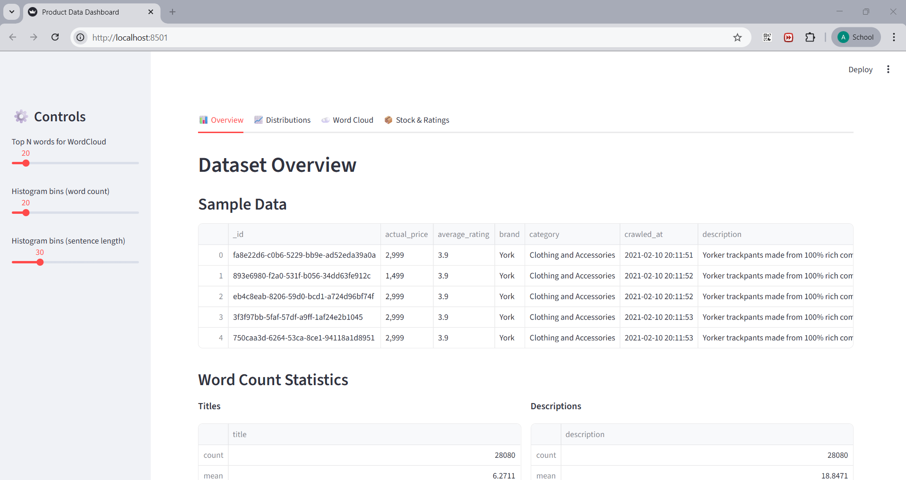

# PART 1: Text Processing and Exploratory Data Analysis

For this first part of the project, we decided to complement the [Jupyter notebook](eda.ipynb) with an actual .py file named [data_prep.py](data_prep.py) in which we defined the functions we used.

In addition, we also created a streamlit web interface to visualize the results in [eda.py](eda.py). 

For this part, we additionally installed the following modules:
+ ``matplotlib``
+ ``seaborn``
+ ``streamlit``
+ ``wordcloud``

The ``requirements.txt`` file was updated accordingly. Make sure to have all these requirements in the virtual environment.

## Functions Description

### 1. `corpus_df_loading(path)`

**Description:** it loads the corpus from the JSON file and returns it as a dataframe.

**Parameters:**

+ ``path`` (str): Path to the JSON file containing the corpus.

**Returns:**

+ ``corpus`` (dict): A dictionary of documents, with numerical fields preprocessed.

Example:

```python
corpus = corpus_df_loading("data/products.json")
```

---

### 2. `build_terms(text)`

**Description:** gets a string and returns the list of preprocessed tokens in which we:
+ convert to lowercase
+ tokenize by splitting in spaces
+ remove punctuation marks
+ remove stopwords
+ apply stemming using PorterStemmer

**Parameters:**

+ ``text`` (str): Input string to preprocess.

**Returns:**

+ ``text`` (list of str): A list of processed tokens.

Example:
```python
tokens = build_terms("This is a sample product title!")
```

---

### 3. `join_buildterms(strings)`

**Description:** combines multiple strings into a single string and then applies ``build_terms()`` to obtain tokens.

**Parameters:**

+ ``strings`` (list of str): List of text strings to process.

**Returns:**

+ ``terms`` (list of str): Preprocessed tokens from all concatenated strings.

Example:
```python
terms = join_build_terms(["This is a title", "This is a description"])
```

---

### 4. `get_articles_info(corpus)`

**Description:** iterates over all documents in the corpus and separates:

+ Categorical fields (``title``, ``description``, ``brand``, ``category``, etc.)
+ Numerical fields (``selling_price``, ``discount``, ``average_rating``, etc.)

It returns two dictionaries:

+ ``metadata``: numerical and status fields for each product.

+ ``index_info``: categorical fields for each product, keyed by ``pid``.

**Parameters:**

+ ``corpus`` (dict): Dictionary of product documents.

**Returns:**

+ ``metadata`` (dict): {pid: {numerical fields}}

+ ``index_info`` (dict): {pid: {categorical fields}}

Example:
```python
metadata, index_info = get_articles_info(corpus)

# Access the selling price of a product
price = metadata["product123"]["selling_price"]

# Access the title of a product
title = index_info["product123"]["title"]
```


## Code Execution

### `data_prep.py`

To execute the test of the functions we created, you can execute this python file. It loads the corpus and prints into two JSON files the dictionaries obtained from `get_articles_info`.

In the terminal, make sure that you are running with the `irwa_venv`, and then execute the following command in the root folder:

```bash
python -m project_progress.part_1.data_prep
```

Take into account that it might take a few seconds to run. Then, the files ``info_index_dict.json`` and ``metadata_dict.json`` will be created in the root folder containing the constructed dictionaries with each documents data.

### `eda.ipynb`

To execute the Jupyter Notebook, just make sure that the environment `irwa_venv` is selected as the Kernel (Python Interpereter).

Open the file in VSCode or download it and upload it into Google colab together with the folder `data` containing the JSON file with the corpus. Then, execute cell by cell to rerun the code and reload the output.

### `eda.py`

To run the streamlit web interface, run the following command in the root folder:

**Windows:**
```bash
streamlit run project_progress\part_1\eda.py
```

**Linux:**
```bash
streamlit run project_progress/part_1/eda.py
```

This will automatically open a tab/window in your default browser where you can visualize and interact with the EDA results.

It should look like this:


