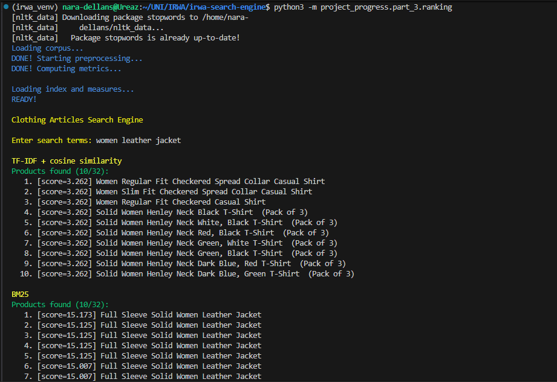

# P# PART 2: Ranking and Filtering

As with Parts 1 and 2, we decided to complement the [Jupyter Notebook](ranking.ipynb) with two .py file named [ranking_filtering.py](ranking_filtering.py) and [word2vec.py](word2vec.py). The **first** one starts a console search engine using the different rankings implemented in this part, and the **second** one shows the top matching documents for 5 predefined queries (ranked using word2vec plus cosine similarity).

## Functions Description

### 1. ``get_numerical_info_by_product(corpus)``

**Description**: Function to process the corpus and get only the preprocessed numerical values for each product.


**Parameters**:
+ ``corpus`` (dict): Dictionary of product documents.

**Returns**:
+ ``result_dict`` (dict): Mapping of product id to its numeric fields ["out_of_stock", "average_rating", "selling_price", and "discount"]

Example:

```python
numeric_data = get_or_create(products_numeric_data_filepath, lambda: get_numerical_info_by_product(corpus))
```

### 2. ``process_products(corpus)``

**Description**: Function that loads the products of the corpus as a dictionary of pid -> list (of categorical data as a list of processed tokens)


**Parameters**:
+ ``corpus`` (dict): Corpus with all the products and all their data.

**Returns**:
+ ``products`` (dict): Mapping of product id to the document as processed tokens (all terms from the document categorical data fields joined and preprocessed)

Example:

```python
products = get_or_create(products_filepath, lambda: process_products(corpus))
```

### 3. ``rank_tf_idf_cosine_similarity(query_terms, products, index, tf, idf, weights)``

**Description**: Perform the ranking of the results of a search based on the tf-idf weights and using cosine similarity

**Parameters**:
+ ``query_terms`` (list): List of query terms.
+ ``products`` (list): List of products to rank that match the query.
+ ``index`` (dict): Inverted index data structure.
+ ``tf`` (dict): Term-frequency structure.
+ ``idf`` (dict): Inverted document-frequency structure.
+ ``weights`` (dict): Field weights used to average the fields when computing the rank.

**Returns**:
+ ``product_scores`` (list): List of [score, product_id] pairs, sorted in decreasing order of relevance.

Example:

```python
scores_tfidf = rank_tf_idf_cosine_similarity(query_terms=query_terms, 
                                    products=filtered_prod,
                                    index=index,
                                    tf=tf,
                                    idf=idf,
                                    weights=WEIGHTS)
```

### 4. ``compute_prod_data(products)``

**Description**: Compute the general metrics for all documents to be used in BM25.

**Parameters**:
+ ``products`` (dict): Mapping of product IDs (pid) to the processed text of each product in the corpus.

**Returns**:
+ ``df`` (dict): Mapping of term to document frequency.
+ ``idf`` (dict): Mapping of term to inverted document frequency.
+ ``Ld`` (dict): Mapping of product id to document length.
+ ``Lave`` (float): Average document length across the entire collection.

Example:

```python
df_bm25, idf_bm25, Ld, Lave = compute_prod_data(products=products)
```

### 5. ``rank_BM25(query_terms, products, filtered_prod, idf, Ld, Lave, k1=1.2, b=0.75)``

**Description**: Rank a set of products using the BM25 ranking algorithm.

**Parameters**:
+ ``query_terms`` (list): Terms appearing in the user query.
+ ``products`` (dict): Mapping pid → list of terms from the categorical variables of each product.
+ ``filtered_prod`` (list): List of product IDs that contain all query terms.
+ ``idf`` (dict): Mapping of terms to inverse document frequency.
+ ``Ld`` (dict): Mapping of product id to document length.
+ ``Lave`` (float): Average document length across the full corpus.
+ ``k1`` (float): Term-frequency tuning parameter (default: 1.2).
+ ``b`` (float): Length-normalization tuning parameter (default: 0.75).

**Returns**:
+ ``RSV_scores`` (list): List of [score, product_id] pairs sorted in decreasing relevance according to BM25.

Example:

```python
scores_BM25 = rank_BM25(query_terms=query_terms,
                                    products=products,
                                    filtered_prod=filtered_prod,
                                    idf=idf_bm25,
                                    Ld=Ld,
                                    Lave=Lave) 
```


### 6. ``rank_custom(query_terms, metadata, products, filtered_prod, idf, Ld, Lave, k1=1.2, b=0.75, lambda_=0.3, popularity=0.3, affordability=0.7, availability=0.01)``

**Description**: Custom ranking function combining BM25 relevance with product metadata such as popularity, affordability, and availability.

**Parameters**:
+ ``query_terms`` (list): Terms appearing in the user query.
+ ``metadata`` (dict): Mapping of product id to dictionary of numerical metadata for each product (e.g., rating, price, stock).
+ ``products`` (dict): Mapping of product id to list of terms from the categorical variables of each product.
+ ``filtered_prod`` (list): Product IDs that contain all query terms.
+ ``idf`` (dict): Mapping of term to inverse document frequency across products.
+ ``Ld`` (dict): Mapping of product id to document length.
+ ``Lave`` (float): Average document length in the full corpus.
+ ``k1`` (float): BM25 term-frequency tuning parameter (default: 1.2).
+ ``b`` (float): BM25 length-normalization tuning parameter (default: 0.75).
+ ``lambda_`` (float): Weight controlling BM25 influence in the final score (higher → stronger BM25 impact). Default: 0.3.
+ ``popularity`` (float): Weight of product rating in the final score (default: 0.3).
+ ``affordability`` (float): Weight of product price and discount in the final score (default: 0.7).
+ ``availability`` (float): Penalization applied when products are out of stock (default: 0.01).

**Returns**:
+ ``custom_scores`` (list): List of [score, product_id] pairs, sorted in decreasing order according to the custom ranking formula.

Example:

```python
scores_custom = rank_custom(query_terms=query_terms,
                                        metadata=numeric_data,
                                        products=products,
                                        filtered_prod=filtered_prod,
                                        idf=idf,
                                        Ld=Ld,
                                        Lave=Lave)   
```


### 7. ``filter(query, products)``

**Description**: Return the list of document IDs whose content contains *all* terms from the query.

**Parameters**:
+ ``query`` (string): The full query text.
+ ``products`` (dict): Mapping of product id to document text.

**Returns**:
+ ``selected_docs`` (list): List of product/document IDs that contain all terms in the query.

Example:

```python
query_terms, filtered_prod = filter(query, products=products)
```


### 8. ``print_ranking(scores, index2title)``

**Description**: Function to print the ranking for an arbitrary algorithm.

**Parameters**:
+ ``scores`` (list): List of [score, pid] pairs, where each score corresponds to the relevance score of the document with ID ``pid``.
+ ``index2title`` (dict): Mapping pid → title string of the corresponding product.

Example:

```python
print_ranking(scores=scores_tfidf, index2title=index2title)
```


### 9. ``get_training_sentences(products)``

**Description**: Function that builds the training sentences from the product description as text.

**Parameters**:
+ ``products`` (dict): Mapping of product id to product text description.

**Returns**:
+ ``sentences`` (list): List of tokenized sentences for training the Word2Vec model.

Example:

```python
training_sentences = get_training_sentences(products)
```


### 10. ``train_word2vec_model(sentences, vector_size=100, window=7, min_count=5, negative=10, sg=1):``

**Description**: Function that trains a Word2Vec model on the given sentences.

**Parameters**:
+ ``sentences`` (list): Tokenized sentences used as the training corpus.
+ ``vector_size`` (int): Dimensionality of the generated word vectors (default: 100).
+ ``window`` (int): Maximum distance between the current and predicted word within a sentence (default: 7).
+ ``min_count`` (int): Minimum frequency required for a word to be included in training (default: 5).
+ ``negative`` (int): Number of negative samples used when applying negative sampling (default: 10).
+ ``sg`` (int): Training algorithm — 1 for skip-gram, 0 for CBOW (default: 1).
+ ``epochs`` (int): Number of training iterations over the corpus.

**Returns**:
+ ``model``: The trained Word2Vec model.

Example:

```python
word2vec_model = train_word2vec_model(training_sentences)
```


### 11. ``build_text_terms(sentences)``

**Description**: Build a flat list of all terms appearing in a collection of tokenized sentences.

**Parameters**:
+ ``sentences`` (list): List of tokenized sentences.

**Returns**:
+ ``term_list`` (list): List containing all extracted terms.

Example:

```python
doc_terms = build_text_terms(text)
```


### 12. ``get_embedding(text, model:Word2Vec)``

**Description**: Compute a document embedding by averaging the Word2Vec embeddings of all its terms.

**Parameters**:
+ ``text`` (list): Tokenized sentences (or terms) representing the document.
+ ``model`` (Word2Vec): Trained Word2Vec model used to obtain term embeddings.

**Returns**:
+ ``embedding``: Numpy array representing the averaged document embedding.

Example:

```python
doc_embeddings[pid] = get_embedding(sentences, word2vec_model)
```


### 13. ``get_document_embeddings(word2vec_model, products)``

**Description**: Compute document embeddings for all products by generating an embedding for each product’s text.

**Parameters**:
+ ``word2vec_model``: Trained Word2Vec model used to compute term embeddings.
+ ``products`` (dict): Mapping pid → text description of each product.

**Returns**:
+ ``doc_embeddings`` (dict): Mapping pid → computed document embedding.

Example:

```python
doc_embeddings = get_document_embeddings(word2vec_model, products)
```


### 14. ``cosine_similarity(document_representation, query_representation)``

**Description**: Compute the cosine similarity between a document embedding and a query embedding.

**Parameters**:
+ ``document_representation``: Numpy array representing the document embedding.
+ ``query_representation``: Numpy array representing the query embedding.

**Returns**:
+ ``similarity``: Cosine similarity score between the document and the query.

Example:

```python
score = cosine_similarity(doc_embedding,query_embedding)
```

### 15. ``rank_documents(w2v_model, doc2vec, query, preprocess=preprocess_string)``

**Description**: Rank documents by computing the cosine similarity between the query embedding and each document embedding.

**Parameters**:
+ ``w2v_model``: Trained Word2Vec model used to compute embeddings.
+ ``doc2vec`` (dict): Mapping pid → document embedding.
+ ``query`` (string): Query string to rank documents against.
+ ``preprocess`` (function): Function applied to preprocess the query (default: ``preprocess_string``).

**Returns**:
+ ``sim_scores`` (list): List of [similarity score, pid] pairs, sorted in descending order of similarity.

Example:

```python
scores_w2vcossim = rank_documents(word2vec_model, filtered_doc_embeddings, query)
```

## Code Execution

### `ranking_filtering.ipynb`
To execute the Jupyter Notebook, just make sure that the environment `irwa_venv` is selected as the Kernel (Python Interpereter). 

Open the file in VSCode or download it and upload it into Google colab together with the folder `data` containing the JSON file with the corpus. Then, execute cell by cell to rerun the code and reload the output.  
This notebook can redirect you to the ``word2vec.ipynb`` Jupyter Notebook. Make sure to have both notebooks in the same directory when you open VSCode, or to upload both to Google colab, if you want to access it. 

### `word2vec.ipynb`
This notebook has no dependencies and can be executed alone. To execute the Jupyter Notebook, just make sure that the environment `irwa_venv` is selected as the Kernel (Python Interpereter). 

Open the file in VSCode or download it and upload it into Google colab together with the folder `data` containing the JSON file with the corpus. Then, execute cell by cell to rerun the code and reload the output.  

### `ranking.py`
To start the search engine, this file needs to be executed. To do so, go in the terminal and make sure the `irwa_venv` is running. Then, execute the following command in the root folder of the repository:

```bash
python -m project_progress.part_3.ranking
```

Take into account that the first time it is executed, it needs to compute the index and it takes around 1 minute. If you excecuted ``word2vec.ipynb`` before, this will not happen as the index has been already computed

Once the index is loaded, the engine starts and you should see this output:


### `word2vec.py`
To compute the ranking of the 5 queries we saw in PART_2, this file needs to be executed. To do so, go in the terminal and make sure the `irwa_venv` is running. Then, execute the following command in the root folder of the repository:

```bash
python -m project_progress.part_3.word2vec
```

Take into account that the first time it is executed, it needs to compute the index and it takes around 1 minute. If you excecuted ``ranking.ipynb`` before, this will not happen as the index has been already computed.

Once the index is loaded, the automatic ranking calculations start and you should see this output:
